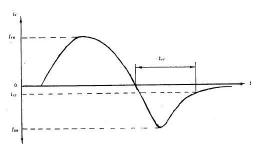
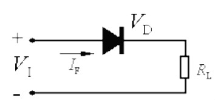
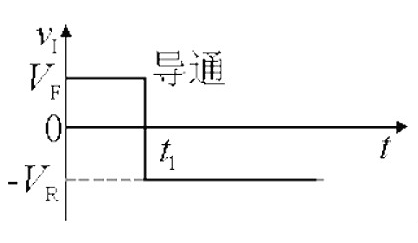

# 1.二极管

## ***（1）二极管反向恢复***

​		二极管作为开关应用的二极管主要是利用了它的通(电阻很小)、断(电阻很大) 特性, 即二极管对正向及反向电流表现出的开关作用。二极管和一般开关的不同在于,“开”与“关”由所加电压的极性决定,  而且“开”态有微小的压降Vf,“关”态有微小的电流I0。当电压由正向变为反向时, 电流并不立刻成为(-I0) , 而是在一段时间ts 内,  反向电流始终很大, 二极管并不关断。

​		经过ts后, 反向电流才逐渐变小, 再经过tf 时间, 二极管的电流才成为(-I0) , 如图1 示。ts 称为储存时间,tf 称为下降时间。tr=ts+tf 称为反向恢复时间, 以上过程称为反向恢复过程。

​		这实际上是由电荷存储效应引起的,  反向恢复时间就是存储电荷耗尽所需要的时间。该过程使二极管不能在快速连续脉冲下当做开关使用。如果反向脉冲的持续时间比tr 短,  则二极管在正、反向都可导通, 起不到开关作用。因此了解二极管反向恢复时间对正确选取管子和合理设计电路至关重要。

​		开关从导通状态向截止状态转变时，二极管或整流器在二极管阻断反向电流之前需要首先释放存储的电荷，这个放电时间被称为反向恢复时间,在此期间电流反向流过二极管。即从正向导通电流为0时到进入完全截止状态的时间。

​		反向恢复过程，实际上是由电荷存储效应引起的，反向恢复时间就是正向导通时PN结存储的电荷耗尽所需要的时间。假设为Trr，若有一周期为T1的连续PWM波通过二极管，当Trr>T1时，二极管反方向时就不能阻断此PWM波，起不到开关作用。二极管的反向恢复时间由Datasheet提供。反向恢复时间快使二极管在导通和截止之间迅速转换，可获得较高的开关速度，提高了器件的使用频率并改善了波形。

​		（就是说，二极管有一定的反向电压，则会有一定时间的反向电流才会反向截止，所以就会有超快恢复的二极管，防止反向电流时间过长导致发热严重）

### *（3-1）1N4007*

​		1N4007的耐压值为1000V，额定正向电流为1A。该管为美国公司生产的二极管，型号中的“1”，指该管为只有一个PN结的器件（即二极管），“N”表示该管已在美国电子工业协会注册登记，“4007”为登记序号。该管为普通的硅整流二极管，<u>这种管子的PN结面积较大，故耐压高，工作电流大，但是其PN结的结电容也大，而这个结电容跟二极管是并联关系，故这种二极管只适用于数百Hz以下的低频整流电路中。若用于上百KHz以上的高频整流电路中，因其结电容较大，管子将失去单向导电作用。</u>	

### *（3-2）UF4007*

​		UF4007虽然外形封装与1N4007完全一样，但是UF4007为快恢复二极管。其耐压值也为1000V，额定正向电流也是1A，但这种管子的反向恢复时间（即从外加反向电压到进入反向阻断状态这一段的过度过程时间）很小，譬如：UF4007的反向恢复时间仅70ns（纳秒），而像1N4007这类低频管，反向恢复时间都较大，手册中通常都不给出这个参数。

​		另外，UF4007这类快恢复二极管的正向导通压降比较大，一般都在0.8～1V以上，而1N4007这类管子的正向压降一般在0.7～0.8V（随流过管子的正向电流不同而异）。

​		UF4007这类快恢复二极管在各种开关电源或电动车充电器中，广泛用于高频整流、续流，而1N4007一般用于工频整流（工频的意思是交流电频率50~60HZ）。使用时，UF4007可以代替1N4007普通整流二极管作为低频整流，但不能用1N4007来代替UF4007作高频整流，因为1N4007在高频电流下，将失去单向导电性。

### 	

## *（2）反向恢复过程详解*

​		硅二极管电路中加入一个如下图所示的输入电压。在0―t1时间内，输入为+$V_F$，二极管导通，电路中有电流流通。

​		设$V_D$为二极管正向压降（硅管为0.7V左右），当$V_F$远大于$V_D$时，VD可略去不计，则

​							      $I_F$ =  $$V_F-V_D/R_L$$

​							当$V_F$ >> $V_D$时：$I_F$ = $V_F$/$R_L$ 

​		在$$t1$$时，$$V$$突然从+$$VF$$变为-$$VR$$。在理想情况下，二极管将立刻转为截止，电路中应只有很小的反向电流。但实际情况是，二极管并不立刻截止，而是先由正向的$$IF$$变到一个很大的反向电流$$IR$$=$$VR$$／$$RL$$，这个电流维持一段时间$$tS$$后才开始逐渐下降，再经过$$tt$$后，下降到一个很小的数值0.1$$IR$$，这时二极管才进人反向截止状态，如下图所示。

​		通常把二极管从正向导通转为反向截止所经过的转换过程称为反向恢复过程。其中$$tS$$称为存储时间，$$tt$$称为渡越时间，$$tre$$=$$ts$$+$$tt$$称为反向恢复时间。由于反向恢复时间的存在，使二极管的开关速度受到限制。

## ***(3)产生反向恢复过程的原因*—电荷存储效应**

​		产生上述现象的原因是由于二极管外加正向电压VF时，载流子不断扩散而存储的结果。当外加正向电压时Ｐ区空穴向Ｎ区扩散，Ｎ区电子向Ｐ区扩散，这样，不仅使势垒区（耗尽区）变窄，而且使载流子有相当数量的存储，在Ｐ区内存储了电子，而在Ｎ区内存储了空穴，它们都是非平衡少数载流于，如下图所示。

​		空穴由Ｐ区扩散到Ｎ区后，并不是立即与Ｎ区中的电子复合而消失，而是在一定的路程LP（扩散长度）内，一方面继续扩散，一方面与电子复合消失，这样就会在LP范围内存储一定数量的空穴，并建立起一定空穴浓度分布，靠近结边缘的浓度最大，离结越远，浓度越小。正向电流越大，存储的空穴数目越多，浓度分布的梯度也越大。电子扩散到Ｐ区的情况也类似，下图为二极管中存储电荷的分布。

​		我们把正向导通时，非平衡少数载流子积累的现象叫做电荷存储效应。

​		当输入电压突然由+$$VF$$变为-$$VR$$时Ｐ区存储的电子和Ｎ区存储的空穴不会马上消失，但它们将通过下列两个途径逐渐减少：①在反向电场作用下，Ｐ区电子被拉回Ｎ区，Ｎ区空穴被拉回Ｐ区，形成反向漂移电流$$IR$$，如下图所示。②与多数载流子复合。

​		在这些存储电荷消失之前，ＰＮ结仍处于正向偏置，即势垒区仍然很窄，ＰＮ结的电阻仍很小，与$$RL$$相比可以忽略，所以此时反向电流$$IR$$=（$$VR$$＋$$VD$$）/$$RL$$。$$VD$$表示ＰＮ结两端的正向压降，一般$$VR$$>>$$VD$$，即$$IR$$＝$$VR$$／$$RL$$。

​		在这段期间，$$IR$$基本上保持不变，主要由$$VR$$和$$RL$$所决定。经过时间ts后Ｐ区和Ｎ区所存储的电荷已显著减小，势垒区逐渐变宽，反向电流IR逐渐减小到正常反向饱和电流的数值，经过时间tt，二极管转为截止。

​		==二极管和一般开关的不同在于,“开”与“关”由所加电压的极性决定, 而且“开”态有微小的压降$$Vf$$,“关”态有微小的电流$$i0$$。当电压由正向变为反向时, 电流并不立刻成为(- $$i0$$) , 而是在一段时间ts 内,反向电流始终很大, 二极管并不关断。==

​		经过ts后,反向电流才逐渐变小, 再经过tf 时间,二极管的电流才成为(- i0),ts称为储存时间,tf 称为下降时间。tr=ts+tf称为反向恢复时间, 以上过程称为反向恢复过程。

​		这实际上是由电荷存储效应引起的, 反向恢复时间就是存储电荷耗尽所需要的时间。该过程使二极管不能在快速连续脉冲下当做开关使用。如果反向脉冲的持续时间比tr 短, 则二极管在正、反向都可导通, 起不到开关作用。

